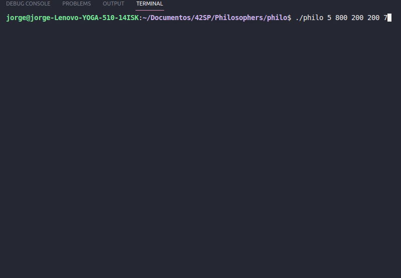
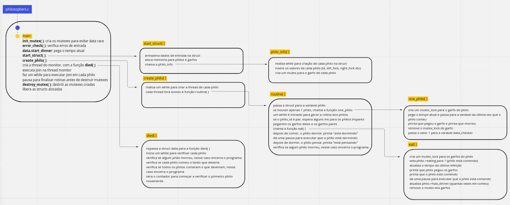

# Philosophers

Thread is the keyword of this project!
Philosophres dynamics are resolved using threads and mutex. A separate thread has been implemented for monitoring Philosophers, to check if any philosophers have died and warn others that they need to stop immediately.

Thread é a palavra chave desse projeto!
A dinamica dos Philosophres é resolvida usando threads e mutex. Uma thread separada foi implementada para o monitoramento do Philosophers,para verificar se algum filósofo morreu e avisa os outros que precisam parar imediatamente.

## Problem to solve  

One or more philosophers are sitting at a round table doing one of three things:
eating, thinking, or sleeping.  
• While eating, they are not thinking or sleeping, while sleeping, they are not eating
or thinking and of course, while thinking, they are not eating or sleeping. 
• The philosophers sit at a circular table with a large bowl of spaghetti in the center. 
• There are some forks on the table. 
• As spaghetti is difficult to serve and eat with a single fork, it is assumed that a
philosopher must eat with two forks, one for each hand. 
• The philosophers must never be starving. 
• Every philosopher needs to eat. 
• Philosophers don’t speak with each other. 
• Philosophers don’t know when another philosopher is about to die. 
• Each time a philosopher has finished eating, he will drop his forks and start sleeping. 
• When a philosopher is done sleeping, he will start thinking. 
• The simulation stops when a philosopher dies. 
• Each program should have the same options: number_of_philosophers time_to_die
time_to_eat time_to_sleep [number_of_times_each_philosopher_must_eat]. 
• number_of_philosophers: is the number of philosophers and also the number of forks  
• time_to_die: is in milliseconds, if a philosopher doesn’t start eating ’time_to_die’
milliseconds after starting his last meal or the beginning of the simulation, it dies  
• time_to_eat: is in milliseconds and is the time it takes for a philosopher to eat. During that time he will need to keep the two forks.  
• time_to_sleep: is in milliseconds and is the time the philosopher will spend sleeping.  
• number_of_times_each_philosopher_must_eat: argument is optional, if all philosophers eat at least ’number_of_times_each_philosopher_must_eat’ 
the simulation will stop. If not specified, the simulation will stop only at the death of a philosopher 

Um ou mais filósofos estão sentados em uma mesa redonda fazendo uma das três coisas: comendo, pensando ou dormindo. 
• Enquanto comem, eles não estão pensando ou dormindo, enquanto dormem, eles não estão comendo ou pensando e, claro, enquanto pensam, eles não estão comendo ou dormindo. 
• Os filósofos sentam-se a uma mesa circular com uma grande tigela de espaguete no centro. 
• Existem alguns garfos na mesa. 
• Como o espaguete é difícil de servir e comer com um único garfo, presume-se que um o filósofo deve comer com dois garfos, um para cada mão. 
• Os filósofos nunca devem passar fome. 
• Todo filósofo precisa comer. 
• Os filósofos não falam uns com os outros. 
• Os filósofos não sabem quando outro filósofo está para morrer. 
• Cada vez que um filósofo termina de comer, ele larga os garfos e começa a dormir. 
• Quando um filósofo termina de dormir, ele começa a pensar. 
• A simulação para quando um filósofo morre. 

## Badge

## Skills
- Unix
- Imperative programming
- Rigor

## Demo

## My grade

## Flowchat:

🚧 project: 

## Access the folder philo for the program that uses threads and mutex
cd philo

## Compile the program with
make

## Run the program
./philo 5 800 200 200 7 

## Clean output objects with
philo$ make fclean

:shower: Clean Obj files: 

philo$ make clean

:shower: :shower: Clean All (obj files + binary): 

philo$ make fclean

:shower: :shower: 🚧 Clean All + build: 

philo$ make re 

 See Makefile 

### Made with:  
### Jorge Alves

 
  

### Alexandre Zamarion

 
  

